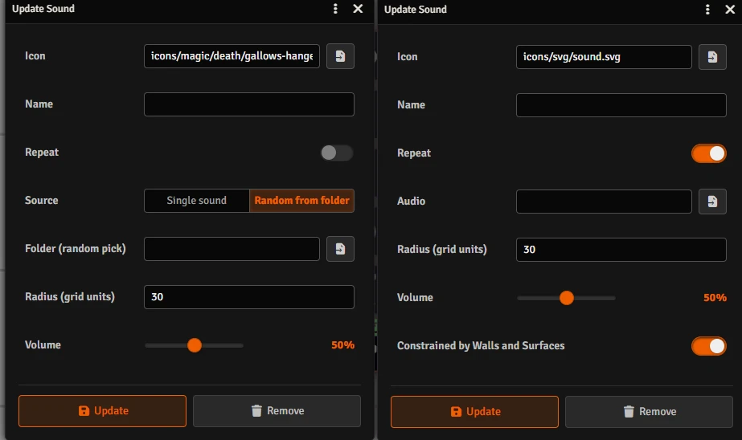
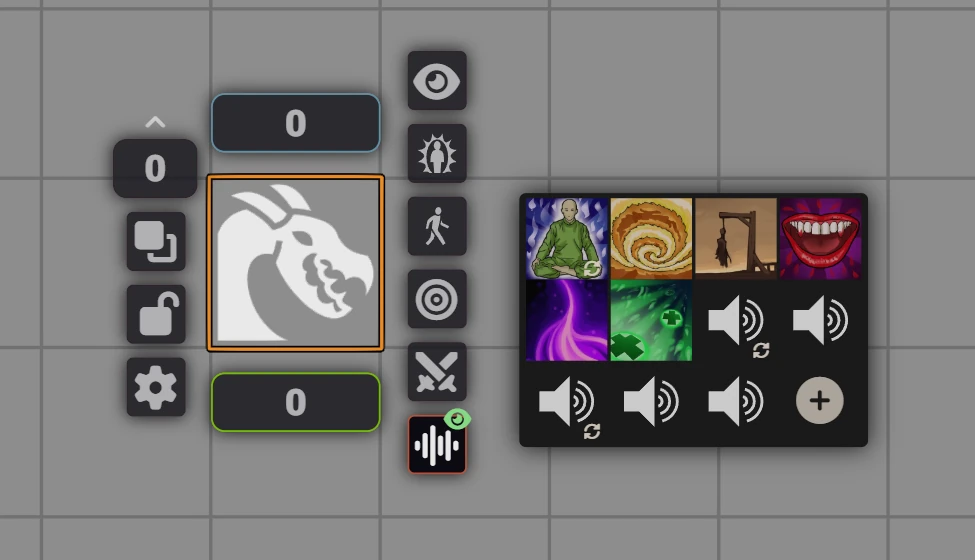
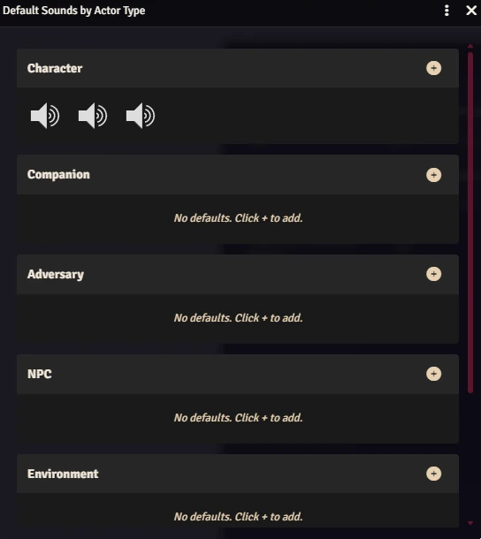

# Token Audio FX

A Foundry VTT module that lets you attach sounds to tokens and play them directly from the Token HUD. Assign ambient music, creature growls, or any audio effect to an Actor, then trigger it with a single click during your session.

Requires **Foundry VTT v14** or later. A GM must be online for sounds to play.

<p align="center">
  
</p>

<p align="center">
  
</p>


[](https://buymeacoffee.com/mestredigital) [](https://mestredigital.online/pages/projetos-en)

---

## How It Works

Each Actor can have a personal **soundboard** — a list of audio clips you configure in advance. When a token is on the canvas, clicking its HUD button opens that soundboard as a row of tiles. Click a tile to play the sound; click it again to stop.

Sounds come in two modes that behave very differently:

### Repeat

A **Repeat** sound loops continuously until you turn it off. When activated, the module creates an invisible AmbientSound object at the token's position and keeps it anchored there as the token moves. The sound respects wall occlusion — players on the other side of a wall may hear it muffled or not at all, just like any other ambient sound in Foundry.

Use repeat sounds for:
- Ongoing ambience tied to a creature (a dragon's rumble, a ghost's wail)
- Background music following a specific character
- Any effect that should persist until manually stopped

### Single (One-Shot)

A **Single** sound plays once from start to finish and then stops on its own. No AmbientSound object is created — the audio is played directly by every client whose tokens are within the sound's radius at the moment you click. When the clip ends, the soundboard tile resets automatically.

Use single sounds for:
- A roar, a spell cast, a door creak — anything that happens once
- Sound effects triggered by player actions

**Folder mode** is available for single sounds only: instead of picking one specific file, you point the sound at a folder and the module picks a random audio file from it each time the tile is clicked.

### Play on Turn Start

Any single sound can be marked as **Play on Turn Start**. When the actor's turn begins in an active combat encounter, the module automatically triggers that sound — no manual click required. Multiple sounds can have this option enabled simultaneously; all of them will play at the start of the turn.

The sound only fires if the actor is a combatant in a started combat. It will not trigger outside of combat or before the GM clicks the Start Combat button.

---

## Setting Up Sounds

1. Select a token and open its **Token HUD** (right-click the token).
2. Click the **Token Audio FX** button (speaker icon) to open the soundboard panel.
3. Click the **+** button at the bottom of the panel to add a new sound.
4. Fill in the configuration form:
   - **Description** — a label shown on the soundboard tile.
   - **Icon** — an optional image for the tile.
   - **Source** — choose *Single sound* to pick one audio file, or *Random from folder* (single mode only) to pick a folder.
   - **Audio / Folder** — path to the file or folder.
   - **Volume** — playback volume (0 – 100%).
   - **Radius** — how far the sound travels, in grid units.
   - **Walls** — whether walls block the sound (repeat mode only).
   - **Repeat** — toggle this on for a looping ambient sound, leave it off for a one-shot.
   - **Play on Turn Start** — toggle this on to automatically play the sound when this actor's turn begins in combat (single sounds only).
5. Save the form. The tile appears in the soundboard immediately.

Sounds configured on an **Actor** are shared across all tokens linked to that actor. Sounds configured directly on an **unlinked token** belong only to that token.

---

## Playing and Stopping Sounds

Open the Token HUD and click the Token Audio FX button to reveal the soundboard.

- **Click a tile** to start the sound.
- **Click the same tile again** to stop it (repeat sounds only — single sounds stop on their own).
- A tile with a pulsing icon indicates an active repeat sound.

### Directed Playback (Ctrl+Click)

**Ctrl+clicking** a single (one-shot) sound tile sends the audio only to the player who has that token's actor assigned as their character — instead of broadcasting to every player with tokens in range.

- The GM always hears the sound regardless.
- If no player has that actor set as their character, **no sound plays**.
- Repeat sounds do not support directed playback; Ctrl+click has no effect on them.

This works from both the GM and from players who have been granted soundboard edit access on the token. The request is always processed by the GM before being delivered to the linked player.

---

## Player Permissions

By default, players can trigger sounds on tokens they own but cannot create or edit the sound list. A GM can grant edit access by **right-clicking** the Token Audio FX HUD button on a player's token. This toggles editing mode, allowing that player to add, configure, and remove sounds on their own tokens.

Whenever a player triggers a sound, the request is forwarded to the active GM to process. **At least one GM must be online** for sounds to work.

---

## Default Sounds by Actor Type

Instead of configuring the same sound on every individual actor, you can define a **default soundboard for each actor type** (e.g. *npc*, *character*, or any type provided by your game system). Every token whose actor matches that type will automatically show those sounds in its HUD.

To open the editor, go to **Game Settings → Module Settings → Token Audio FX** and click the **Configure** button next to *Default Sounds by Actor Type*. The editor lists every registered actor type; use the **+** button under a type to add a sound, and **right-click** an existing tile to edit or remove it.

A few things to keep in mind:

- Type-default tiles appear in the Token HUD alongside the actor's own sounds, but they **cannot be edited from the HUD**. Changes must be made through the settings editor.
- If an actor has its own sound with the same ID as a type default, the **actor's sound takes precedence**.
- Type defaults are world-level settings, so they apply to every actor of that type across the entire world. Only a GM can change them.

<p align="center">
  
</p>

---

## Module Settings

| Setting | Description |
|---|---|
| **Audio Channel** | Mixer channel used for all module sounds: *Interface*, *Music*, or *Environment* (default). |
| **Default Sounds by Actor Type** | Configure a base soundboard that is automatically shown on every token of each actor type. |

---

## Manual Installation

In Foundry VTT, go to **Add-on Modules → Install Module** and paste the manifest URL:

```
https://raw.githubusercontent.com/brunocalado/token-sounds/main/module.json
```

---

## License

This module is released under the [LICENSE](LICENSE) included in this repository.

Based on [Sound of Token](https://github.com/Aedif/token-sounds) by Aedif.
